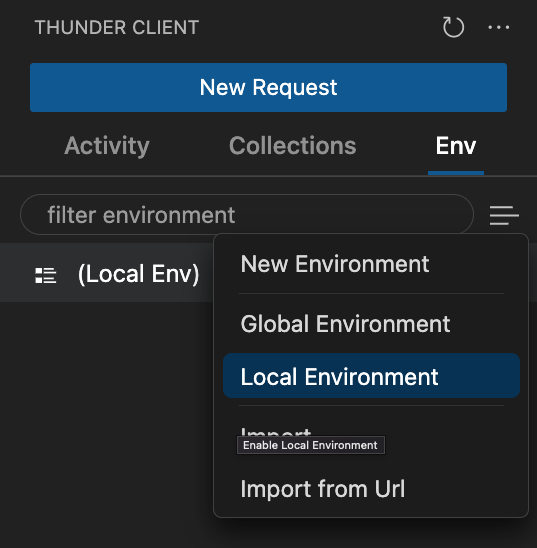
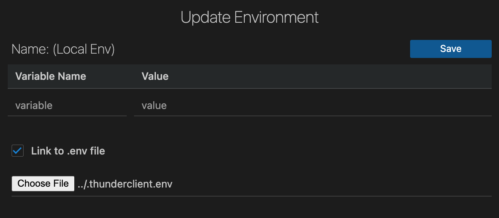
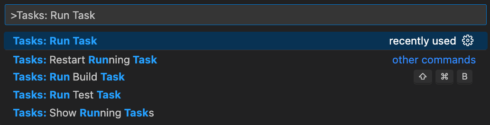
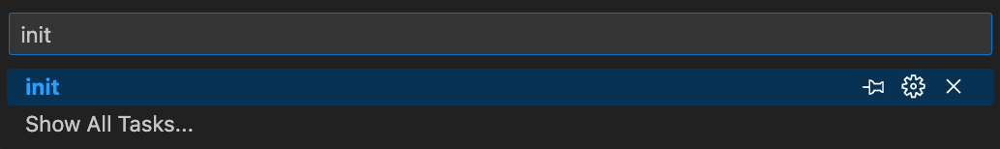

# VitusPay DynamoDb Zod Example App

## About

The purpose of this application is to demonstrate how to use Zod with TypeScript for some common workflows in VitusPay.

The application uses Express for easy local development and testing. While this is not indicative of current VitusVet architecture it makes learning TypeScript concepts easier.

## Getting started

### Set AWS profile

Set your AWS profile to the VitusVet dev environment. You will need these credentials to access DynamoDb.

### Set Node version

This project uses a .nvmrc file to specify the version of Node required. Please be sure to use the correct version of Node.

### Initialize the project

The is a VS Code task that can initialize the project for you including installing Node modules.

Run the `init` task.

See the section below on how to run tasks if you are unfamiliar.

## Local development

Local development is easy provided you have followed the instructions for setting up and initializing the project. There is a task that will get you started.

Run the `dev` task.

See the section below on how to run tasks if you are unfamiliar.

## Testing

### Manual testing

Manual testing can be done with Thunder Client.

- Install the Thunder Client extension.
- Run this script to add a .env file for Thunder Client to use. Be sure to change the username and password.

```sh
echo 'username=someone@vitusvet.com
password=123safeEnoughForMe!' > .thunderclient.env
```

#### Troubleshooting Thunder Client

You need to ensure that you have a local environment set up and selected.

If for some reason you do not have a local environment set up follow these images to add one including your .thunderclient.env file to access variables there.





### Automated testing

Automated testing is done with `Vitest`.

There is an npm script to start the test runner: `npm run test`

## Tasks

Tasks are a way to automate things in VS Code.

Tasks exist in .vscode > tasks.json

To run a task follow these steps:

1. Open the command palette

   - MacOS: `cmd + shift + p`
   - Windows: `ctrl + shift + p`

2. Search for "Tasks: Run Task" and hit the enter key



3. Select a task with the arrow keys and hit enter
   - Alternatively you can search for a specific task like in the image below


